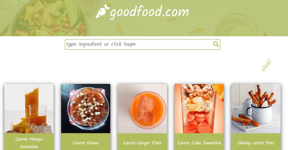

# goodfood
That's my first project created in React. I used free API, so it has restrictions and sometimes can render recipes slowly. But I hope you'll like my application. 
Anyway, I like it!

## Running the app:
https://kingakurzawa.github.io/goodfood/

 

## Technologies:
Project is created with:
* React
* REST API
* SCSS
* RWD

## Install:
After you clone this repo to your desktop, go to its root directory and run npm install to install its dependencies.
Once the dependencies are installed, you can run npm start to start the application. You will then be able to access it at localhost:3000

